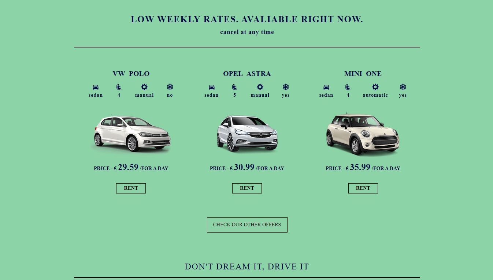
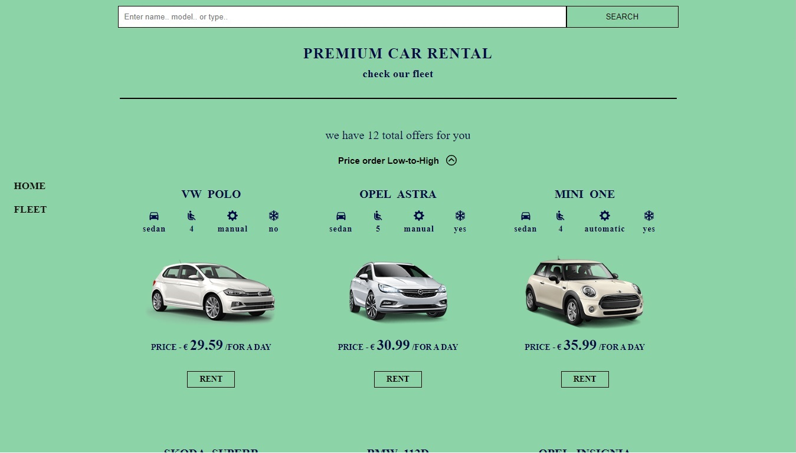
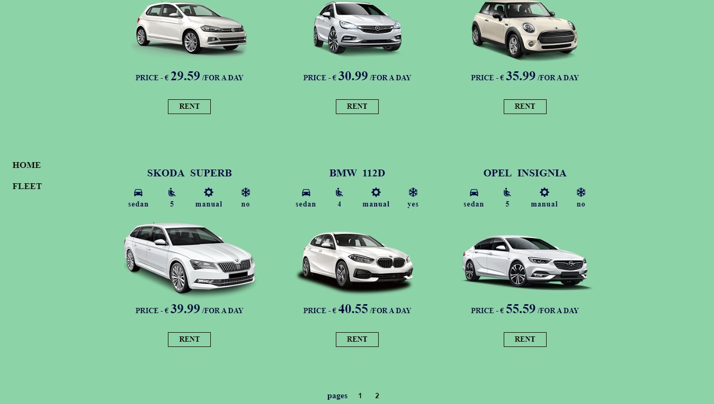
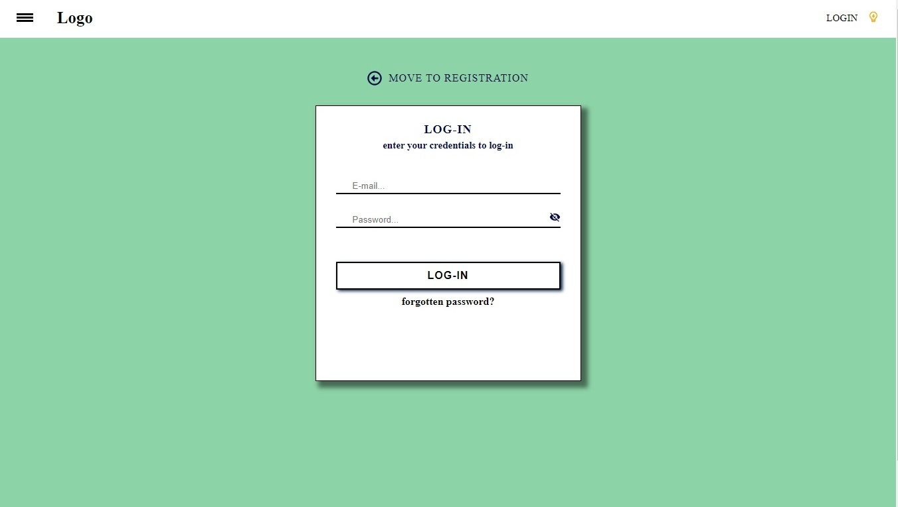
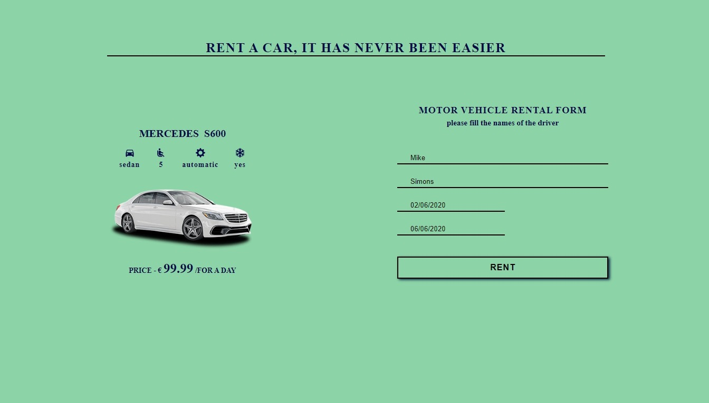
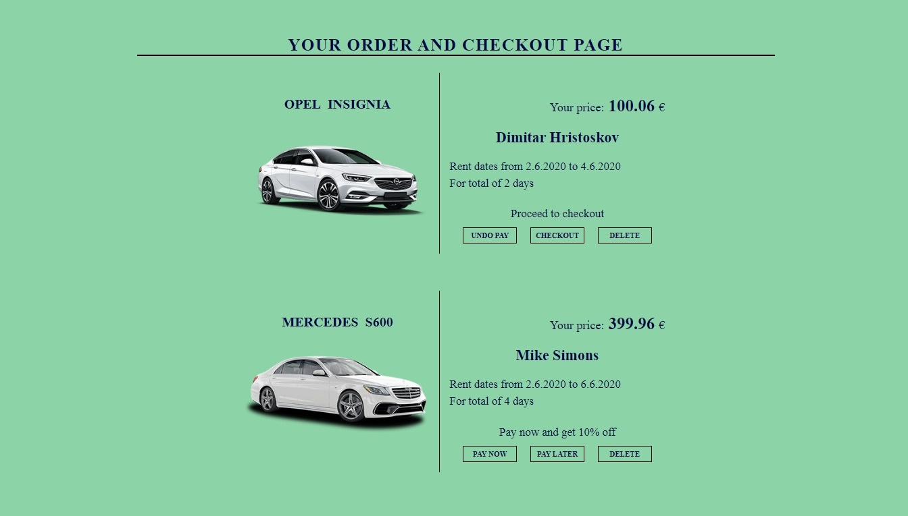

 rent-a-car-single page app
 # Rent a Car <h1>
 ### Single Page Application <h3>

 React, Node, MongoDB, Express - MERN Stack - "Rant-a-car Single Page App"

	* top 3 offers (landing page)
	* 3 main types subcategory (landing page)
	* log-in
	* register
	* reset password
	* reset e-mail with generated token valid 1h
	* client side validation
	* backend side validation (Express - validator)
	* rent a car 
	* search by name, model, type
	* sort by price
	* place an order
	* pay now (reduce price with 10%)
	* pay later
	* PDF invoice
	* confirmation e-mail (invoice e-mail)
	* simple gsap - "GreenSock" - animation

 ### Landing Page <h3>
	* top 3 cars to rent
	* 3 main category(sedan, coupe, SUV)
 

 ### Fleet Page <h3>
	* search bar to search ( by model, name or type )
	* sort the fleet by price
 

### Fleet Page <h3>
	* client side pagination
 

### Auth Page <h3>
	* login, register
	* reset password, reset email
 

### Rent Page <h3>

 

### Auth Page <h3>
	* Delete Order
	* pay now, pay later - changing the price if pay now (backend)
	* Invoice Email on Checkout
	* PDF Invoice
 

All calculations or changes in price or product are made in backend
